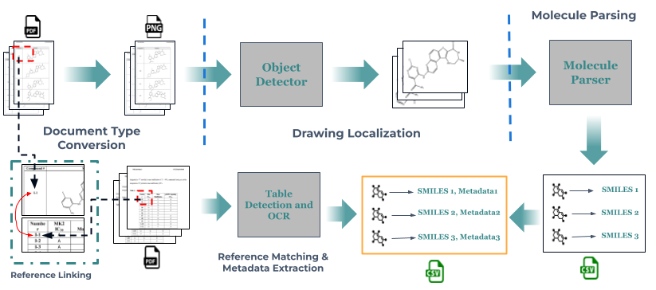

# MoleculeMiner: Extraction of Drawn Molecules with Associated Tabular Data 
This project is the culmination of the work done by Abhisek Dey (2024 Research Intern - Cheminformatics) and is the full pipeline for converting PDF documents (Patents/Journals/Articles) into its encapsulated drawn 2D molecule figures as a canonical SMILES representation for downstream tasks along with tabular data such as Reactivity, Yield, Purity, Conditions etc.

It has 4 main Stages:

1. Converting PDFs to Images at 300 DPI resolution
2. Detecting any molecule regions in each of those pages
3. Parsing each molecule region into its Canonical SMILES Representation
4. (Optional) Extracts table information for any molecule that has been found


Stage **2** uses a YOLOv8 detector from [Ultralytics](https://docs.ultralytics.com/modes/predict/) trained on supervised chemical region detection data from the [ScanSSD-XYc]() paper. Stage **3** is developed from the original [MolScribe](https://pubs.acs.org/doi/10.1021/acs.jcim.2c01480) paper. Stage **4** is created using GPT-4o and conventional OCR.

|  | 
|:--:| 
| *Pipeline Overview* |

## Table of Contents
<!-- TOC -->
* [Quick Start](#quick-start)
  * [Installation (EC-2 Instance Only)](#installation-ec-2-instance-only)
  * [Test-Run Patent Data and Model Weights (S3 Storage)](#test-run-patent-data-and-model-weights-s3-storage)
  * [Start a test run with given PDFs](#start-a-test-run-with-given-pdfs)
    * [Using your Own PDFs](#using-your-own-pdfs)
    * [Using Table Mode](#using-table-mode)
  * [Additional Args](#additional-args)
* [Training and Evaluating Individual Components](#training-and-evaluating-individual-components)
* [Server & Server Deployment](#server--server-deployment)
* [Authors, Maintainers and Acknowledgements](#authors-maintainers-and-acknowledgements)
<!-- TOC -->

## Quick Start

Running this pipeline requires a modern NVIDIA GPU with preferably at least 10GB of VRAM. (Has been tested on `p3.2xlarge` instance with a V100 GPU)

### Installation (Ubuntu)
The easiest way to install all dependencies is through setting up your own conda environment and installing the packages there.

```shell
conda create -n molminer python=3.10
conda activate molminer
pip install -r requirements.txt
```

### Test-Run Patent Data and Model Weights (S3 Storage)
* Best Model Weights **(both detection and parsing models)** are available at `s3://2025-molecule-miner/weights/`
* Patent PDFs to test pipline are available at `s3://2025-molecule-miner/pipeline_inpdfs/`

**Note:** To access weights and data stored in S3, please ensure you have the AWS CLI installed. You can follow the installation process below:
```shell
curl "https://awscli.amazonaws.com/awscli-exe-linux-x86_64.zip" -o "awscliv2.zip"
unzip awscliv2.zip
sudo ./aws/install
```
#### Setting up AWS to access our public S3 bucket
After installation or if you already have AWS CLI installed run the following to ensure access our public S3 storage bucket:

```shell
aws s3 ls --no-sign-request s3://2025-molecule-miner
```

#### Downloading weights and data
1. The weights should be copied to a folder named `weights`. From the root of this project run:
    ```shell
    mkdir weights
    aws s3 cp s3://2025-molecule-miner/weights/ weights --recursive --no-sign-request
    ```
2. The test PDFs and annotation files should be copied to the folder `inputs`. From the root of this project run:
    ```shell
    mkdir inputs && cd inputs
    mkdir test_small && cd ..
    aws s3 cp s3://2025-molecule-miner/pipeline_inpdfs/ inputs/ --recursive --no-sign-request
    ```

### Start a test run with given PDFs
**Note:** You would need to export a few PYTHONPATHS to ensure you do not get `ModuleNotFoundError` first.

From the root of this project run (with `DEBUG` mode):
```shell
export PYTHONPATH="${PYTHONPATH}:$(pwd)/MolScribe:$(pwd)/MolScribe/molscribe:$(pwd)/molminer"
python molminer/pipeline/pipeline_run.py --logmode DEBUG
```

The outputs should be produced in the `outputs` directory. It should contain directories named after the PDFs and each directory should contain a file named `mol_smiles.csv` containing the molecule smiles and another directory `overlaid_pages` containing debug output pages with boxes overlaid on them if `--logmode DEBUG` was set.

#### Using your Own PDFs
For using your own PDF(s), create your own directory inside the `inputs` directory and run the same pipeline command pointing to the new directory.

```shell
export PYTHONPATH="${PYTHONPATH}:$(pwd)/MolScribe:$(pwd)/MolScribe/molscribe:$(pwd)/molminer"
python molminer/pipeline/pipeline_run.py  --in_pdfs inputs/<your directory> --logmode DEBUG
```

#### Using Table Mode
MoleculeMiner now can extract tabular data from tables. This includes any metadata found anywhere in the PDF inside a table and linked to the drawn molecules by a reference number. This uses, among other logic, OCR and the OpenAI API to detect reference numbers and tables and parse them. To use the table, simply add the `--tables` argument with the run command and the output will still be a csv file with any metadata found for the respective molecules.

```shell
export PYTHONPATH="${PYTHONPATH}:$(pwd)/MolScribe:$(pwd)/MolScribe/molscribe:$(pwd)/molminer"
python molminer/pipeline/pipeline_run.py  --in_pdfs inputs/<your directory> --tables
```


### Additional Args

* `--in_pdfs`: Path to a single PDF or a directory of PDF(s) to be used in the pipeline
* `--out_dir`: The base directory which will house all the outputs corresponding to the PDFs given
* `--logmode`: The logging mode for the pipeline. Can be set to `DEBUG`, `INFO`, `WARNING`, `ERROR`, `CRITICAL`. Setting this to `DEBUG` will produce debug outputs in the `overlaid_pages` directory.
* `--detect_weight`: Path to the YOLOv8 detection weights
* `--parser_weight`: Path to the MolScribeV2 model weights
* `--tables`: (Arg Only) If set, will run in table mode to detect table metadata for the parsed molecule diagram(s)

## Training and Evaluating Individual Components

If a need arises that a new model needs to be trained 
* For training your own detection (YOLOv8) model please refer to the [Detection_README](molminer/detection/README.md).
* For training/evaluating your own parsing (MolScribe v2) model please refer to the [Parsing_README](MolScribe/README.md)

## Server & Server Deployment
To facilitate easy adoption and improve user experience, we've developed a server (frontend and backend) that can be used to run the pipeline on a web interface.

Please refer to the [server README](server/README.md) for more information.

## Authors, Maintainers and Acknowledgements

* Abhisek Dey (Insitro, Research Intern - Cheminformatics 2024) - Author and Maintainer
* Nate Stanley (Insitro, CDD, Director) - Mentor and Manager
* Srinivasan Sivanandan (Insitro, Senior ML Scientist) - Advisory
* Matt Langsenkamp (DPRL, RIT, Research Programmer) - Refined the current version of DPRL's archive of the Molecular Structure Recognition Dataset
